# Contractor Website Template - Site Structure Diagram

## Overview
This diagram represents the internal link structure of a contractor website template based on Screaming Frog crawl data.

## Visual Site Structure (Mermaid Diagram)

```mermaid
graph TD
    A[Homepage /] --> B[Contact /contact/]
    A --> C[About /about/]
    A --> D[Service Area /service-area/]
    A --> E[GBP Category 1 /google-business-category-1/]
    A --> F[GBP Category 2 /google-business-category-2/]
    A --> G[GBP Category 3 /google-business-category-3/]
    A --> H[GBP Category 5 /service-gbp-5/]
    A --> I[Main Service 1 /main-service-provided-1/]
    A --> J[Main Service 2 /main-service-provided-2/]
    A --> K[Main Service 3 /main-service-3/]
    
    D --> L[Service Area Hub 2 /service-area-hub-2/]
    
    E --> E1[Sub-Page 1]
    E --> E2[Sub-Page 2]
    E --> E3[Sub-Page 3]
    E --> E4[Sub-Page 4]
    E --> E5[Sub-Page 5]
    E --> E6[Sub-Page 6]
    
    F --> F1[Sub-Page 1]
    F --> F2[Sub-Page 2]
    F --> F3[Sub-Page 3]
    F --> F4[Sub-Page 4]
    F --> F5[Sub-Page 5]
    F --> F6[Sub-Page 6]
    
    G --> G1[Sub-Page 1]
    G --> G2[Sub-Page 2]
    G --> G3[Sub-Page 3]
    G --> G4[Sub-Page 4]
    G --> G5[Sub-Page 5]
    G --> G6[Sub-Page 6]
    
    H --> H1[Sub-Page 1]
    H --> H2[Sub-Page 2]
    H --> H3[Sub-Page 3]
    H --> H5[Sub-Page 5]
    H --> H6[Sub-Page 6]
    
    I --> I1[Sub-Service 1 Page 1]
    I --> I2[Sub-Service 1 Page 2]
    I --> I3[Sub-Service 1 Page 3]
    
    J --> J1[Sub-Service 2 Page 1]
    J --> J2[Sub-Service 2 Page 2]
    J --> J3[Sub-Service 2 Page 3]
    
    style A fill:#e1f5ff
    style B fill:#fff4e1
    style C fill:#fff4e1
    style D fill:#fff4e1
    style E fill:#e8f5e9
    style F fill:#e8f5e9
    style G fill:#e8f5e9
    style H fill:#e8f5e9
    style I fill:#f3e5f5
    style J fill:#f3e5f5
    style K fill:#f3e5f5
```



## Site Structure (Text Diagram)

```
┌─────────────────────────────────────────────────────────────┐
│                    HOMEPAGE (/)                              │
│  Title: (Service) In (City & Area) | (Business Name)        │
│  H1: We Are The Best (Service-GBP Primary Category) In (City)│
└─────────────────────────────────────────────────────────────┘
                            │
        ┌───────────────────┼───────────────────┐
        │                   │                   │
        ▼                   ▼                   ▼
┌──────────────┐   ┌──────────────┐   ┌──────────────┐
│   CONTACT    │   │    ABOUT     │   │ SERVICE AREA │
│   (/contact/)│   │  (/about/)   │   │(/service-area/)│
└──────────────┘   └──────────────┘   └──────────────┘
                            │
                            ▼
                    ┌──────────────┐
                    │ SERVICE AREA │
                    │  HUB 2       │
                    │(/service-area-hub-2/)│
                    └──────────────┘

┌─────────────────────────────────────────────────────────────┐
│              GOOGLE BUSINESS PROFILE CATEGORIES              │
└─────────────────────────────────────────────────────────────┘

┌─────────────────────────────────────────────────────────────┐
│  GBP Category 1: /google-business-category-1/               │
│  Title: (Service GBP Category-1) + (Service Area) | (Business Name)│
│  H1: (Service/GBP Secondary Category-1) in (Service Area)   │
└─────────────────────────────────────────────────────────────┘
    │
    ├─── /page-1-sub-gbp-category-1/
    ├─── /page-2-sub-gbp-category-1/
    ├─── /page-3-sub-gbp-category-1/
    ├─── /page-4-sub-gbp-category-1/
    ├─── /page-5-sub-gbp-category-1-copy/
    └─── /page-6-sub-gbp-category-1/

┌─────────────────────────────────────────────────────────────┐
│  GBP Category 2: /google-business-category-2/               │
│  Title: (Service GBP Category-2) + (Service Area) | (Business Name)│
│  H1: (Service/GBP Secondary Category-2) in (Service Area)   │
└─────────────────────────────────────────────────────────────┘
    │
    ├─── /page-1-sub-gbp-category-2/
    ├─── /page-2-sub-gbp-category-2/
    ├─── /page-3-sub-gbp-category-2/
    ├─── /page-4-sub-gbp-category-2/
    ├─── /page-5-sub-gbp-category-2/
    └─── /page-6-sub-gbp-category-2/

┌─────────────────────────────────────────────────────────────┐
│  GBP Category 3: /google-business-category-3/               │
│  Title: (Service GBP Category 3) + (Service Area) | (Business Name)│
│  H1: (Service/GBP Secondary Category-3) in (Service Area)   │
└─────────────────────────────────────────────────────────────┘
    │
    ├─── /page-1-sub-gbp-category-3/
    ├─── /page-2-sub-gbp-category-3/
    ├─── /page-3-sub-gbp-category-3/
    ├─── /page-4-sub-gbp-category-3/
    ├─── /page-4-sub-gbp-category-5-copy/
    ├─── /page-5-sub-gbp-category-3/
    └─── /page-6-sub-gbp-category-3/

┌─────────────────────────────────────────────────────────────┐
│  GBP Category 5: /service-gbp-5/                            │
│  Title: (Service GBP Category 5) + (Service Area) | (Business Name)│
│  H1: (Service/GBP Secondary Category-5) in (Service Area)   │
└─────────────────────────────────────────────────────────────┘
    │
    ├─── /page-1-sub-gbp-category-5/
    ├─── /page-2-sub-gbp-category-5/
    ├─── /page-3-sub-gbp-category-5/
    ├─── /page-5-sub-gbp-category-5/
    └─── /page-6-sub-gbp-category-5/

┌─────────────────────────────────────────────────────────────┐
│                    MAIN SERVICES                             │
└─────────────────────────────────────────────────────────────┘

┌─────────────────────────────────────────────────────────────┐
│  Main Service 1: /main-service-provided-1/                  │
│  Title: (Main Service Provided #1) + (Service Area) | (Business Name)│
│  H1: (Main Service Provided #1) in (Service Area)           │
└─────────────────────────────────────────────────────────────┘
    │
    ├─── /sub-service-1-page-1/
    ├─── /sub-service-1-page-2/
    └─── /sub-service-1-page-3/

┌─────────────────────────────────────────────────────────────┐
│  Main Service 2: /main-service-provided-2/                  │
│  Title: (Main Service Provided #2) + (Service Area) | (Business Name)│
│  H1: (Main Service Provided #2) in (Service Area)           │
└─────────────────────────────────────────────────────────────┘
    │
    ├─── /sub-service-2-page-1/
    ├─── /sub-service-2-page-2/
    └─── /sub-service-2-page-3/

┌─────────────────────────────────────────────────────────────┐
│  Main Service 3: /main-service-3/                           │
│  Title: (Main Service Provided #3) + (Service Area) | (Business Name)│
│  H1: (Main Service Provided #3) in (Service Area)           │
└─────────────────────────────────────────────────────────────┘

┌─────────────────────────────────────────────────────────────┐
│                    ADDITIONAL PAGES                          │
└─────────────────────────────────────────────────────────────┘

┌─────────────────────────────────────────────────────────────┐
│  Home Page 2: /home-page-2/                                 │
│  Title: Home Pge #2                                          │
│  H1: We Are The Best (Service) In (City)                    │
└─────────────────────────────────────────────────────────────┘

## Page Hierarchy Summary

### Level 1 (Root Pages)
- `/` - Homepage
- `/contact/` - Contact Page
- `/about/` - About Page
- `/service-area/` - Service Area Hub
- `/service-area-hub-2/` - Service Area Hub 2
- `/home-page-2/` - Alternative Homepage

### Level 2 (GBP Category Pages)
- `/google-business-category-1/` - GBP Secondary Category 1
- `/google-business-category-2/` - GBP Secondary Category 2
- `/google-business-category-3/` - GBP Secondary Category 3
- `/service-gbp-5/` - GBP Secondary Category 5
- `/main-service-provided-1/` - Main Service 1
- `/main-service-provided-2/` - Main Service 2
- `/main-service-3/` - Main Service 3

### Level 3 (Sub-Service Pages)
Each GBP category and main service has multiple sub-service pages:
- **GBP Category 1**: 6 sub-service pages (page-1 through page-6)
- **GBP Category 2**: 6 sub-service pages (page-1 through page-6)
- **GBP Category 3**: 6 sub-service pages (page-1 through page-6)
- **GBP Category 5**: 5 sub-service pages (page-1, page-2, page-3, page-5, page-6)
- **Main Service 1**: 3 sub-service pages (sub-service-1-page-1 through page-3)
- **Main Service 2**: 3 sub-service pages (sub-service-2-page-1 through page-3)

## URL Pattern Structure

### GBP Category Pages
- Pattern: `/google-business-category-{N}/` or `/service-gbp-{N}/`
- Sub-pages: `/google-business-category-{N}/page-{X}-sub-gbp-category-{N}/`

### Main Service Pages
- Pattern: `/main-service-provided-{N}/` or `/main-service-{N}/`
- Sub-pages: `/main-service-provided-{N}/sub-service-{N}-page-{X}/`

## SEO Structure

### Title Tag Pattern
- Homepage: `(Service) In (City & Area) | (Business Name)`
- GBP Categories: `(Service GBP Category-N) + (Service Area) | (Business Name)`
- Sub-Services: `(Sub-Service/Sub-GBP-Category-N-Page-X) + (Service Area)`
- Main Services: `(Main Service Provided #N) + (Service Area) | (Business Name)`

### H1 Pattern
- Homepage: `We Are The Best (Service-GBP Primary Category) In (City)`
- GBP Categories: `(Service/GBP Secondary Category-N) in (Service Area)`
- Sub-Services: `(Sub-Service/Sub-GBP-Category-N-Page-X) in (Service Area)`
- Main Services: `(Main Service Provided #N) in (Service Area)`

## Total Page Count
- **Level 1 Pages**: 6 pages
- **Level 2 Pages**: 7 category/service pages
- **Level 3 Pages**: ~35 sub-service pages
- **Total HTML Pages**: ~48 pages

## Internal Linking Structure
- Homepage links to all main category pages
- Category pages link to their respective sub-service pages
- All pages link back to homepage and contact page
- Service area hubs link to relevant service pages

